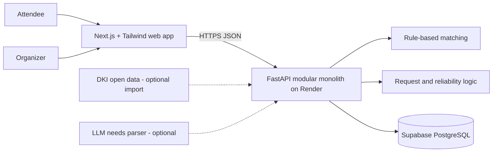
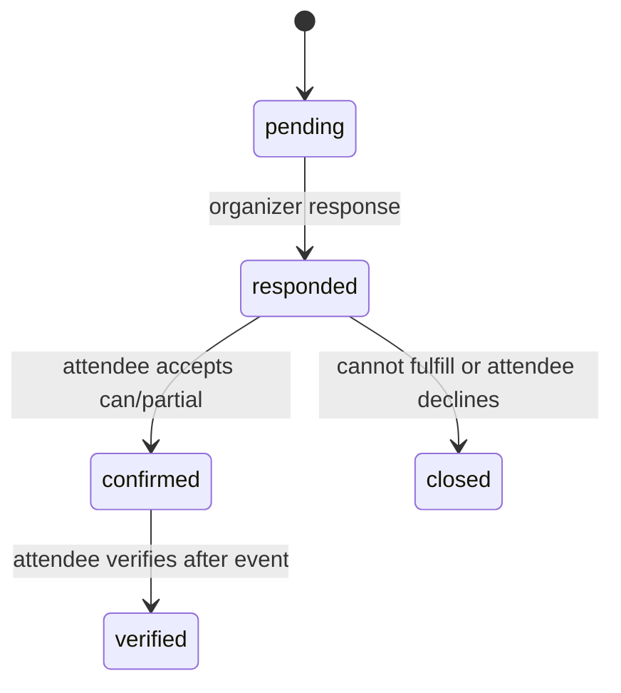

# EventEase — Architecture

Status: proposed implementation boundary based on the exsum. `shared/API.md` is the FE/BE wire contract. Repository and framework details not shown in the exsum are marked below.

## System

**CONFIRMED in exsum diagram:** Next.js + Tailwind CSS web application, REST backend, PostgreSQL, optional LLM/NLP needs parser, rule-based weighted matching, rule-based reliability aggregation, DKI Jakarta open-data seed. **CONFIRMED by the latest user decision:** Python/FastAPI modular monolith, Supabase-hosted PostgreSQL, Render Docker deployment, and JWT for the BE-001 demo-auth foundation. The local backend directory is `BE-EventEase/`. **NEEDS DECISION:** FE/BE remote repository URLs and a real-user authentication flow after the demo. The current demo login issues JWTs to seeded synthetic accounts and is not real-user authentication.

## Ownership

| Boundary | FE | BE | Shared |
| --- | --- | --- | --- |
| UI and accessibility | Pages, forms, semantic labels, keyboard/focus states, clear score explanation, loading/error/empty states | — | Product wording |
| Rules and state | Render the result returned by API; fixture-only calculations may mirror it for development | Validation, persistence, weighted score, request transitions, reliability computation, authorization | `API.md` enums, fields, status codes |
| Data | No database or secrets in browser | Database, seed/import provenance, ownership checks | Seven-attribute vocabulary |

FE must work against fixtures conforming to `API.md`; BE must run with HTTP tests without FE. Integration changes are made only after both sides satisfy the contract independently.

## Seven attributes and score

| API key | Exsum meaning | Attendee input | Organizer claim |
| --- | --- | --- | --- |
| `step_free_entrance` | Step-free entrance | required / not required | 0 / 0.5 / 1 / null |
| `elevator_or_ramp` | Elevator or ramp | required / not required | 0 / 0.5 / 1 / null |
| `accessible_restroom` | Accessible restroom | required / not required | 0 / 0.5 / 1 / null |
| `accessible_seating` | Accessible seating | required / not required | 0 / 0.5 / 1 / null |
| `rest_area` | Rest area | required / not required | 0 / 0.5 / 1 / null |
| `parking_or_dropoff` | Accessible parking/drop-off | required / not required | 0 / 0.5 / 1 / null |
| `walking_distance` | Tolerable walking distance | short / moderate / any | descriptive distance in metres, or null |

### P0 matching rule (proposed)

The exsum gives the weighted-sum formula but no numeric AHP weights. Use the following **ASSUMPTION** as `provisional-v1` until the product owner confirms weights and distance thresholds:

1. Start with a base weight of 1 for each of the seven attributes.
2. For each of the six facility attributes, set a relative coefficient of 2 if required and 0.25 otherwise. For walking distance, use 2 for `short`, 1 for `moderate`, and 0.25 for `any`.
3. Divide each coefficient by the sum of all seven coefficients. The resulting normalized `wᵢ` is in `[0,1]`, as in the exsum. The API breakdown's `weight` field reports the **relative coefficient before normalization**.
4. Set fulfillment `xᵢ` for a known facility claim to its organizer value: 0, 0.5, or 1. For a known distance, use the table below. For an unknown value, use `xᵢ=0` conservatively and include that key in `unknown_attributes`.
5. Calculate `score = round(100 × Σ(wᵢ × xᵢ))`. Return all seven breakdown rows, the score, unknown keys, and `weight_version`.

| Walking tolerance | Full (`x=1`) | Partial (`x=0.5`) | Unmet (`x=0`) |
| --- | --- | --- | --- |
| `short` | ≤ 200 m | 201–500 m | > 500 m |
| `moderate` | ≤ 500 m | 501–1000 m | > 1000 m |
| `any` | Any known nonnegative distance | — | — |

FE renders the BE result and does not calculate a production score. Unknown information must be labeled `unknown`, never presented as accessible. If weights or thresholds change, update this document and `API.md` together before implementation.

The exsum mentions an AHP panel but supplies no numeric weights. Do **not** describe provisional weights as AHP-derived. Spatial matching requires a node/edge venue graph that is not supplied; keep it P1 and do not draw a route from venue-level flags.

## Data model

| Entity | Core fields and relation |
| --- | --- |
| `User` | id, display name, role `attendee`/`organizer`, demo credential hash or auth subject |
| `NeedProfile` | user id, six booleans, walking tolerance, updated time |
| `Organizer` | id, owner user id, name, reliability score/sample count |
| `Venue` | id, name, Jakarta location text, optional coordinates, source label and checked time |
| `Event` | id, organizer id, venue id, title, start/end, status, published time |
| `AccessibilityClaim` | event id, six fulfillment values, walking metres, source, updated time |
| `AccessibilityRequest` | id, event id, attendee id, needs snapshot, arrival estimate, note, response and commitment state, timestamps |
| `Verification` | id, request id, attendee id, per-attribute actual status, submitted time; unique per request |

Do not overwrite the needs snapshot or original organizer response after confirmation; both are needed to interpret later verification.

**P0 reliability rule (ASSUMPTION):** map each of the seven verification answers to 1 / 0.5 / 0. Average these values across the 20 most recent verifications for that organizer, multiply by 100, and round. `sample_count` counts verifications in that window, not attributes. With no evidence, return `score:null,sample_count:0`. This is a feedback indicator, not independent certification. A future version could score only specifically promised attributes after the response stores structured promises.

## Request state and failures

BE enforces ownership and transitions; FE only offers valid actions. On API failure, retain form state and show retry. On missing claim, display `Unknown` and ask for confirmation. On absent external data or LLM, use reviewed seed data and checklist. No secret or private note is logged in the browser or published as venue information.

## Technical risks

1. No actual AHP weights or route graph: use explicitly provisional weights; cut spatial routes.
2. Government data mapping may not cover event-specific conditions: preserve provenance; rely on organizer claims for current event and mark unknowns.
3. Cross-repo drift: shared `API.md` is authoritative; pin the same revision in both PRs, run contract fixtures and one integrated smoke path.
4. Event timing during demo: seed one upcoming and one past event; verification is allowed only for past event.
