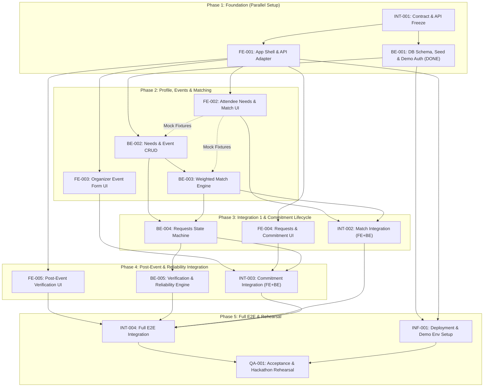

# EventEase — Comprehensive Dependency Map & Implementation Plan

Dokumen ini berisi pemetaan lengkap dependensi antar-task (Frontend, Backend, dan Shared/Integration), status implementasi saat ini, serta panduan langkah pengerjaan (*execution roadmap*) untuk menyelesaikan MVP 24-jam **EventEase**.

---

## 🗺️ Peta Dependensi Keseluruhan (FE ↔ BE ↔ INT)

### Diagram Flow Dependensi (Mermaid)

---

## 📌 Tabel Matriks Task & Status Dependensi

| Task ID | Nama Task | Repository | Prasyarat Dependensi | Paralel Execution? | Status Implementasi |
|---|---|---|---|---|---|
| **INT-001** | Contract Freeze | Shared | None | Ya (dengan Repo Setup) | ✅ **CLEAR** |
| **BE-001** | BE Base, DB & Seed | Backend | INT-001 (SOFT) | Ya (dengan FE-001) | ✅ **DONE** (Implemented & Tested) |
| **FE-001** | FE Shell & Adapter | Frontend | INT-001 (SOFT) | Ya (dengan BE-001) | ⏳ **PENDING** (FE Dev) |
| **BE-002** | Needs & Event CRUD | Backend | BE-001 (HARD) | Ya (Paralel dgn FE-002/003) | 🎯 **NEXT BE TASK** |
| **BE-003** | Weighted Match Engine | Backend | BE-002 (HARD) | Ya (setelah BE-002) | 🎯 **NEXT BE TASK** |
| **FE-002** | Attendee Match UI | Frontend | FE-001 (HARD), BE-002/003 (SOFT via Fixtures) | Ya (pakai Mock Fixture) | ⏳ **PENDING** (FE Dev) |
| **FE-003** | Organizer Event Form | Frontend | FE-001 (HARD), BE-002 (SOFT) | Ya (Paralel dgn FE-002) | ⏳ **PENDING** (FE Dev) |
| **INT-002** | Match Integration | FE + BE | FE-002 + BE-003 | ❌ **TIDAK** (Blocking Integration) | 🔒 Menunggu FE-002 & BE-003 |
| **BE-004** | Request State Machine | Backend | BE-002 (HARD), BE-003 (SOFT) | Ya (Paralel dgn BE-003 & FE-004) | 🔒 Menunggu BE-002 |
| **FE-004** | Accommodation Request UI | Frontend | FE-001 (HARD), BE-004 (SOFT) | Ya (Paralel dgn FE-002/003) | ⏳ **PENDING** (FE Dev) |
| **INT-003** | Commitment Integration | FE + BE | FE-003 + FE-004 + BE-004 | ❌ **TIDAK** | 🔒 Menunggu FE-003, 004 & BE-004 |
| **BE-005** | Verification & Reliability | Backend | BE-004 (HARD) | Ya (Paralel dgn FE-005) | 🔒 Menunggu BE-004 |
| **FE-005** | Verification UI | Frontend | FE-001 (HARD), BE-005 (SOFT) | Ya (Paralel dgn FE-004) | ⏳ **PENDING** (FE Dev) |
| **INT-004** | Full Integration E2E | FE + BE | FE-005 + BE-005 + INT-002 + INT-003 | ❌ **TIDAK** | 🔒 Menunggu seluruh INT & Module |
| **INF-001** | Deployment / Render | DevOps | BE-001 + FE-001 | Ya (Kapan saja setelah base) | ⏳ **PENDING** |
| **QA-001** | Final Demo Rehearsal | QA | INT-004 + INF-001 (HARD) | ❌ **TIDAK** (Langkah Terakhir) | 🔒 Menunggu seluruh pengerjaan |

---

## 🎯 Rencana Pengerjaan Rinci (Execution Roadmap)

### 1. Jalur Backend (BE Execution Roadmap)
Dengan diselesaikannya **BE-001**, urutan pengerjaan fitur backend selanjutnya adalah:

1. **BE-002 (Needs Profile & Event CRUD):**
   - Implementasi endpoint `GET/PUT /api/users/me/needs` untuk profil 7 kebutuhan aksesibilitas.
   - Implementasi endpoint `GET /api/events`, `GET /api/events/{id}`, dan `POST /api/events`.
2. **BE-003 (Weighted Match Engine):**
   - Implementasi algoritma scoring `S = Σ(wᵢ × xᵢ) / Σwᵢ × 100`.
   - Endpoint `POST /api/events/{id}/match` yang mengembalikan skor, breakdown 7 baris, serta flag `unknown`.
3. **BE-004 (Accessibility Request State Machine):**
   - Implementasi endpoint pengajuan `POST /api/events/{id}/requests`, list `GET /api/requests`, respons organizer `PUT /api/requests/{id}/response`, dan konfirmasi attendee `PUT /api/requests/{id}/confirm`.
4. **BE-005 (Post-Event Verification & Reliability):**
   - Implementasi `POST /api/requests/{id}/verify` dan agregasi *Organizer Reliability Score* berbasis 20 verifikasi terakhir.

---

### 2. Jalur Frontend (FE Execution Roadmap)
1. **FE-001 Shell & Adapter:** Menyiapkan struktur project FE, router, state auth demo, dan API adapter (mock fixtures dari `shared/API.md`).
2. **FE-002 s/d FE-005 (Parallel Page UI):** Membuat halaman UI (Checklist kebutuhan, Event detail + breakdown skor, Form publish event organizer, Inbox request komitmen, dan Modal verifikasi post-event).

---

### 3. Milestone Integrasi Vertikal (INT Milestones)
- **INT-002:** Menghubungkan FE Match UI dengan API BE-002 & BE-003.
- **INT-003:** Menghubungkan FE Request & Event Form dengan API BE-004.
- **INT-004:** Menghubungkan FE Verification Form dengan API BE-005 dan melakukan pengujian *end-to-end* seluruh alur utama MVP.
