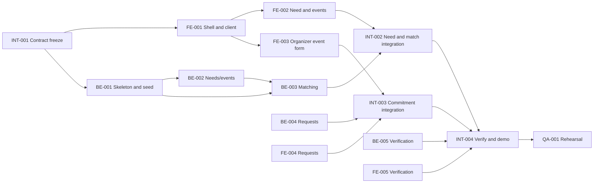

# EventEase — Shared 24-hour execution plan

This file coordinates the two independent repositories. Detailed implementation tasks live in `fe/TASKS.md` and `be/TASKS.md`; cross-repository and QA tasks live in `shared/TASKS.md`. Together they are the task board. The latest user decision selects FastAPI, Supabase PostgreSQL, Render Docker, and JWT for the local BE-001 foundation. The two remote repository URLs, actual AHP weights, real-user auth, and DKI import mapping remain `NEEDS DECISION`; resolve only the decisions needed for the current P0 task without blocking contract-shaped FE/BE work.

## Strategy and workstreams

Freeze the P0 scope and `shared/API.md` first. FE builds pages and API adapter against fixtures; BE builds routes, rules, and persistence with HTTP tests. Integrate vertically as soon as the first usable endpoint is ready, rather than waiting for every page and endpoint. Use one seeded upcoming and one past event to make the whole journey demonstrable.

| Workstream | Primary output |
| --- | --- |
| FE | Attendee and organizer journeys, fixture adapter, accessible states |
| BE | Demo auth, event/need/request/verification APIs, scoring and reliability |
| Integration | Connect FE adapter to BE, resolve contract drift, smoke test |
| Infrastructure | Reproducible seed, environment configuration, demo deployment or local fallback |
| QA | End-to-end path, unknown/error cases, demo rehearsal |

## Dependency map

FE-002/003/004/005 and BE-002/003/004/005 can progress in parallel where `API.md` supplies a fixture. The arrows into INT tasks are **INTEGRATION** dependencies. Some BE tasks depend HARD on BE-001 schema; FE tasks depend HARD on FE-001 shell. `shared/TASKS.md` lists exact task dependencies.

**Critical path:** API freeze → BE skeleton/seed → needs/events → matching → first FE/BE integration → request response/confirmation → verification/reliability → full smoke → rehearsal. If request or verification slips, the product loop is incomplete; protect those tasks before P1 features.

## Timeline

| Time | Milestone and exit gate |
| --- | --- |
| T+0–2h | Name owners, locate FE/BE repositories, choose BE framework/auth/host, freeze API and seed contract. FE/BE setup begins in parallel. |
| T+2–8h | FE builds attendee/organizer views against fixtures. BE implements schema, seed, needs/events, matching. First HTTP responses match fixtures. |
| T+8–14h | FE request/verification screens; BE request state machine and reliability; integrate needs/events/match as each endpoint lands. |
| T+14–18h | Complete request and verification integrations; fix contract and state defects. No new P1 work after T+16h. |
| T+18–21h | Deploy or prepare local fallback; run full journey, unknown/error cases, seed reset, and presentation data check. |
| T+21–24h | Feature freeze; bug fixes only, two demo rehearsals, buffer for credentials/network/deployment failure. |

## MVP cut line

| Time remaining | Keep | Stop/cut |
| --- | --- | --- |
| 8h | Complete core Need→Match→Commit→Verify→Improve on seed data; integrate and test. | P1 route graph, DKI import, LLM parser; P2 items. |
| 4h | Fix the earliest broken link in the full flow; maintain one upcoming and one past event, two demo roles, a saved request/response, and a verification. | New screens, broad styling changes, algorithm tuning without evidence. |
| 2h | Freeze features, use known-good seed/reset, run smoke and rehearsal, prepare local demo fallback. | All feature development except a blocker fix needed to make the core flow run. |

If an external service fails, switch to the reviewed seed and checklist. If deployment fails, demonstrate a documented local FE+BE setup with the same contract and seed. Never fabricate a successful external import or independent accessibility verification.

## Phase 2 backlog (post-P0)

These tasks extend the product after the P0 Need→Match→Commit→Verify loop is stable and demoable, per the priority table in `PROJECT.md`. They are not part of the 24-hour critical path above and must not delay it.

| ID | Title | Priority | Depends on |
| --- | --- | --- | --- |
| BE-006 / FE-006 | Real registration and login | P1 | BE-001 / FE-001 |
| BE-007 | Jakarta open data import | P1 | BE-002 |
| BE-002 (extended) / FE-007 | Venue coordinates and map rendering | P2 | BE-002 / FE-001 |
| BE-009 / FE-008 | Claim evidence media upload | P2 | BE-002 / FE-003 |
| BE-010 / FE-009 | Advanced event search | P2 | BE-003 / FE-002 |

Full scope, acceptance criteria, and API contracts are in `be/TASKS.md`, `fe/TASKS.md`, and `shared/API.md` (BE-API-014–018). Notifications remain undocumented by user decision; revisit only after this backlog.
